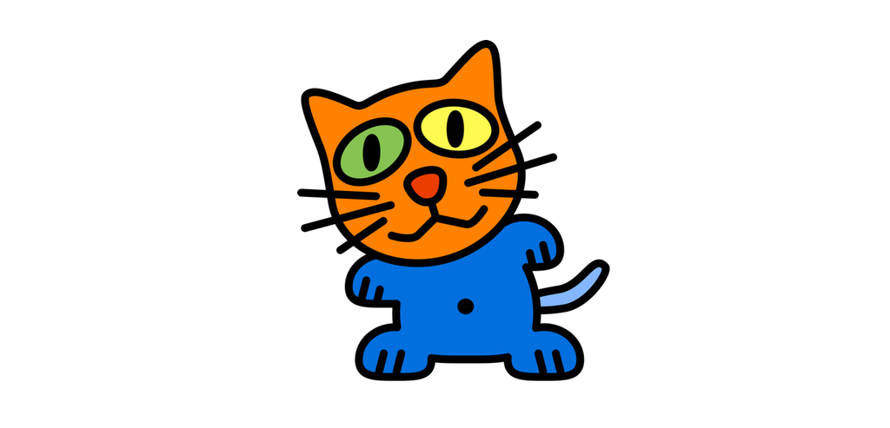
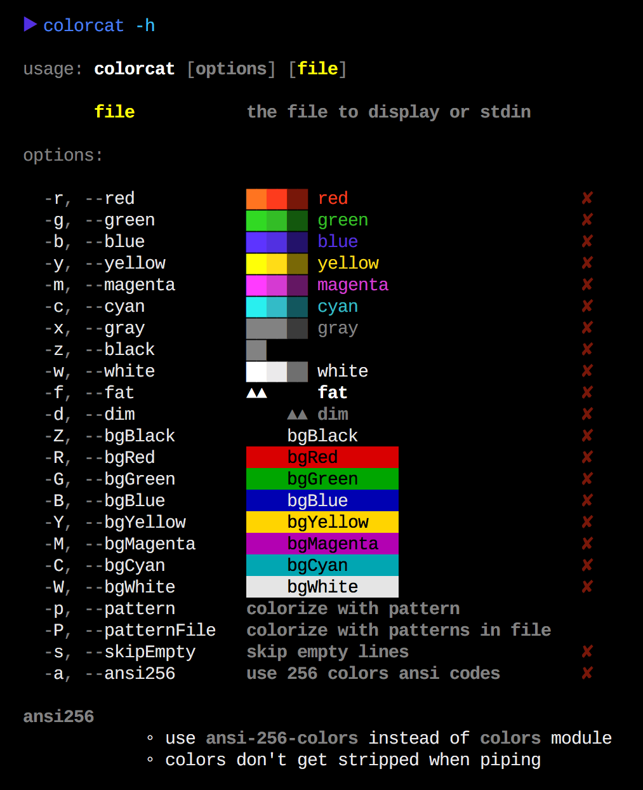
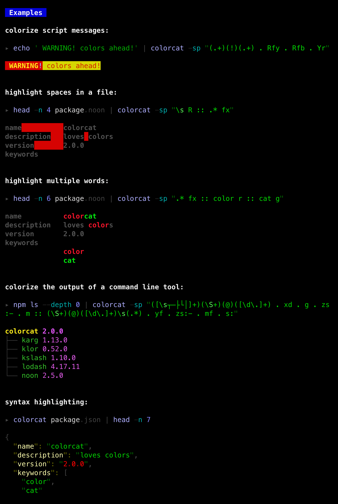
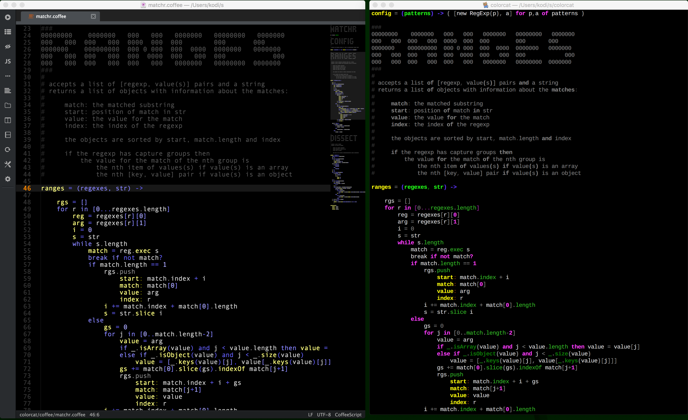

### examples

The examples were generated by [this shell script](./test/test.sh).

### syntax highlighting

Contains syntax highlighting patterns for

- [coffee](./syntax/coffee.noon)
- [noon](./syntax/noon.noon) 
- [json](./syntax/json.noon) 
- [yaml](./syntax/yaml.noon) 
- [jade](./syntax/jade.noon) 
- [html](./syntax/html.noon) 
- [styl](./syntax/styl.noon) 
- [css](./syntax/css.noon) 
- [md](./syntax/md.noon) 
- [js](./syntax/js.noon) 

A side by side comparison of my atom and colorcat highlighting for coffeescript:

colorcat hopes you won't suffer brain damage due to too much colors :)