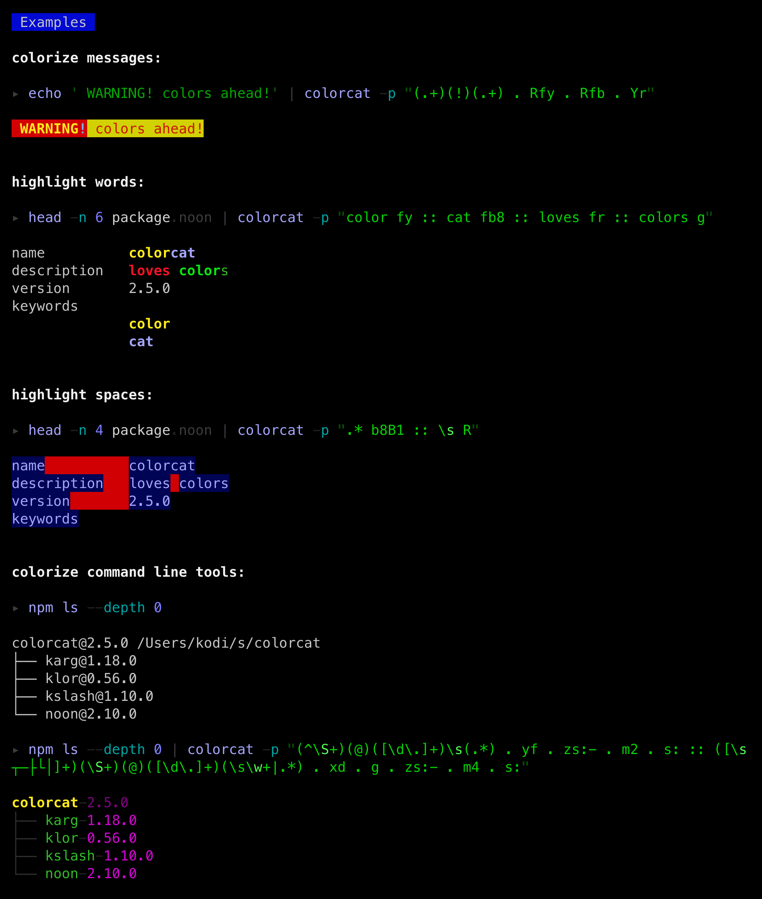

colorcat wants to add colors to your console experience in two ways:

- colorize piped output of other shell commands
- syntax highlighting of files

## colorize piped output

The examples were generated by [this shell script](./test/test.sh).

## syntax highlighting

Contains syntax highlighting patterns for

- [coffee](./syntax/coffee.noon) [js](./syntax/js.noon) 
- [py](./syntax/py.noon) [cpp](./syntax/cpp.noon)
- [noon](./syntax/noon.noon) [yaml](./syntax/yaml.noon) [cson](./syntax/cson.noon) [json](./syntax/json.noon) [ini](./syntax/ini.noon)
- [pug](./syntax/pug.noon) [html](./syntax/html.noon) 
- [styl](./syntax/styl.noon) [css](./syntax/css.noon) 
- [md](./syntax/md.noon) 

## usage

